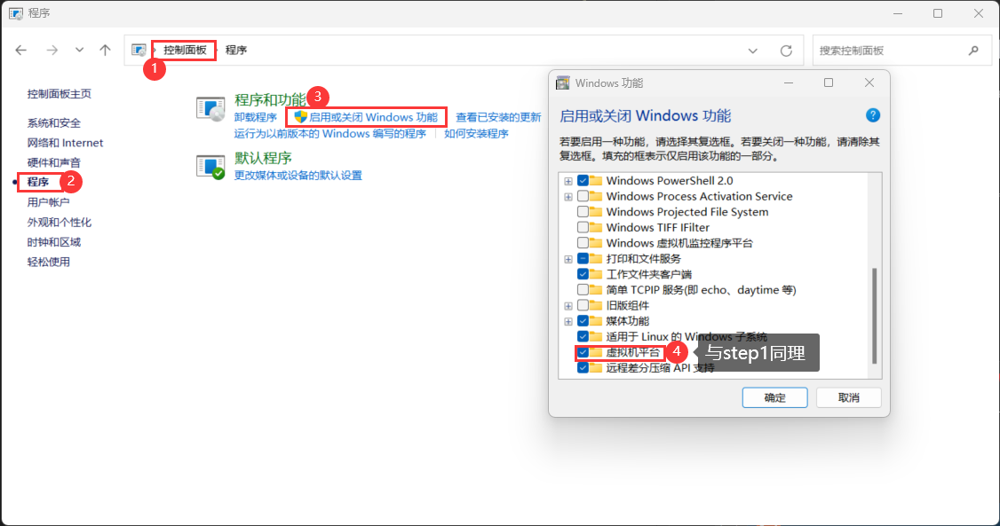
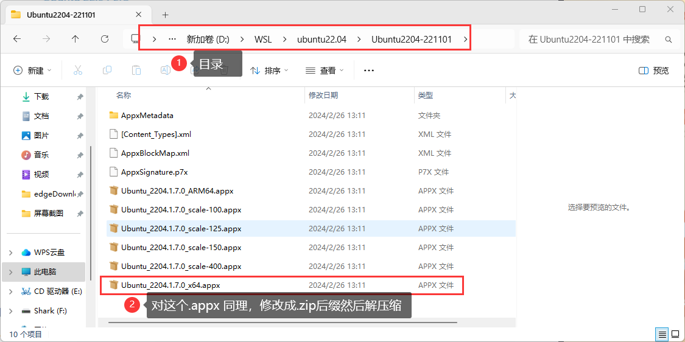
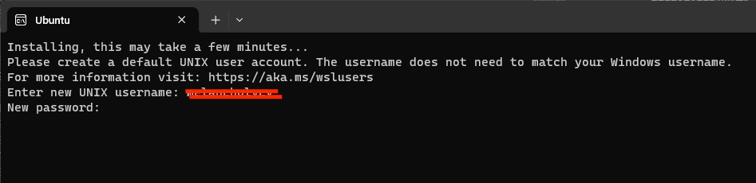
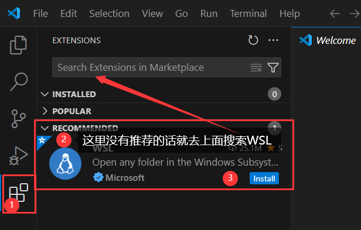
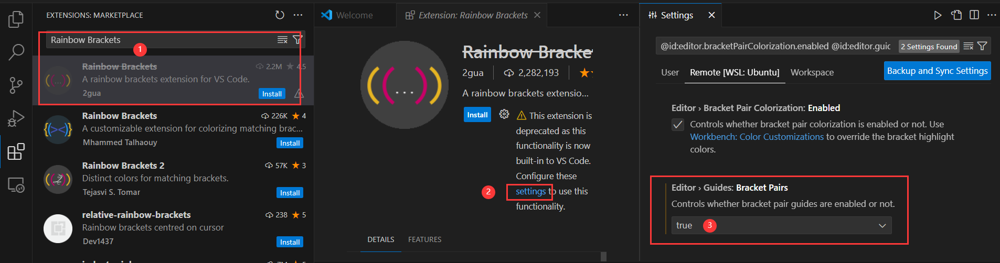

# 1. **科学上网**
写代码和google上搜东西的话或需要科学上网，不能多说，只有一个比较好用的网址，不贵。[科学上网VPN](https://du9so.com/)。
# 2. **linux-ubuntu22.04 LTS版本**
## 2.1. **Ubuntu可选途径**
### 2.1.1. 虚拟机
虚拟机软件  [VMware Workstation Pro](http://www.zhanshaoyi.com/18882.html)    
Ubuntu22.04LTS镜像文件  
网上搜个教程即可，装坏了也没关系，删了重新装即可，所以胜在容错率高，但是不是很好用，新手学学玩玩的话推荐。

## 2.2. WSL2
相当于`windows`的`linux`子系统，安装起来非常快速方便，后续教程主要是用`WSL2`来学习，对初学者比较友好。    
## 2.3. 双系统
会装的话，双系统是最好的，但因为装的话需要有一定基础，所以大家就自己捣鼓吧。推荐使用[ventoy](https://www.ventoy.net/cn/)来制作镜像启动U盘.  

## 2.4. **WSL2安装步骤**
[官方教程-中文](https://learn.microsoft.com/zh-cn/windows/wsl/install-manual)  
[官方教程-英文](https://learn.microsoft.com/en-us/windows/wsl/install-manual)  

跟着官方教程的话在第六步时。  
**步骤 6 - 安装所选的 Linux 分发**  
直接用`Microsoft Store`的话默认是安装到**C**盘的,安装的东西多的话会把C盘占满，如果C盘比较大的话就无所谓，有预留`100G`就差不多够了.所以后面这是一个安装到**非C盘**的教程    
[WSL2安装到非C盘教程](https://blog.csdn.net/weixin_45840825/article/details/127138564)      

<font color = "red"> 以下是我按官方教程安装一步一步的实现,所以主要参考还是官方教程，以下纪录只是我按照安装的过程，且最后我安装到了非C盘，可以结合两个步骤一起(上面两个教程多少有一些小问题和不明确，下面写的算是解决了一些bug和不明确的地方)，环境如下 </font>
- `win11`
- `ubuntu22.04`  

### 2.4.1. **官方中文教程step-1 启用适用于 Linux 的 Windows 子系统**
以管理员身份打开`powershell`,运行以下命令   
`powershell`打开方式  


  


```bash
dism.exe /online /enable-feature /featurename:Microsoft-Windows-Subsystem-Linux /all /norestart
```
运行之后呈现以下状态:

  


然后依次打开并单击<font color = "red"> **控制面板** > **程序** > **启动或关闭Windows功能**</font>,最后如下图所示,所以上面的命令就是打开下面这个功能，通过点点点最后勾选上也是同理  


### 2.4.2. **官方中文教程step-2 检查运行 WSL 2 的要求**
搜搜 **系统信息**, 查看操作系统版本，但这个一般都满足的，`step2`一般情况下可忽略不计。


### 2.4.3. **官方中文教程step-3 启用虚拟机功能**
以管理员身份打开`powershell`,运行以下命令     
```shell
dism.exe /online /enable-feature /featurename:VirtualMachinePlatform /all /norestart
```
结果:        
    

然后依次打开并单击<font color = "red"> **控制面板** > **程序** > **启动或关闭Windows功能**</font>,最后如下图所示




<font color = "red">**step3结束后必须重启**</font>  


### 2.4.4. **官方中文教程step-4 下载 Linux 内核更新包**

      

下载后双击安装，安装之前确保重启过电脑，一路`next`然后最后点`finish`就安装成功了。  

### 2.4.5. **官方中文教程step-5 将WSL2设置为默认版本**

管理员格式打开`powershell`，然后执行以下命令,会显示操作成功完成    
```shell
wsl --set-default-version 2
```

### 2.4.6. **step6(与官方教程异) 安装至非C盘**
以下步骤可以参考我之前推荐的[WSL2安装到非C盘教程](https://blog.csdn.net/weixin_45840825/article/details/127138564), 还是官方教程中文链接一直往下拉，到**下载发行版**,点击后会进行下载，速度会比较慢，可以考虑开梯子or链接**校园网**试试。

  


下载后之后，我将他移动至D盘里面，尽量保证有`100GB`的余量,然后确保打开文件显示后缀，如下图所示:

  

然后将后缀名改成`.zip`，这里也就是将`Ubuntu2204-221101.AppxBundle`文件重命名为`Ubuntu2204-221101.zip`,然后进行解压缩，然后进入文件夹，如下图所示

      
   
然后会变成如下图所示,输入你的用户名和密码,输入密码时不会显示*号，这是unix的安全性考虑，所以肯定输入进去了。
    

      
  
然后以防万一，用管理员身份打开`CMD`终端,运行以下命令  
```bash
wsl --update
``` 
按照以上安装步骤的话基本上没问题,视频中应该会一步一步安装一下。安装完成之后就可以按照以下步骤来打开和实现`win`和`linux`实现共享文件
    

安装好之后以下标出来的文件可以删掉，也可以不删，已经实验删了也不影响工作。    

以及上个目录下的 **`Ubuntu2204-221101.zip`** 压缩包也可以删除掉以节省内存。    

如果还想同时安装其他发行版本，可以参考一下教程  
[英文原版教程](https://cloudbytes.dev/snippets/how-to-install-multiple-instances-of-ubuntu-in-wsl2)  
[英文原版教程的翻译](https://blog.csdn.net/zhyh1986/article/details/134292636)  
[如何下载镜像然后import](https://szthanatos.github.io/series/wsl2/coding_with_wsl2_01/#:~:text=%E5%89%8D%E5%BE%80%20Ubuntu%20Cloud%20Images%20%E5%AE%98%E6%96%B9%E9%95%9C%E5%83%8F%E7%AB%99%EF%BC%8C%20%E4%B8%8B%E8%BD%BD%E9%95%9C%E5%83%8F%E3%80%82%20%E4%BB%A5%20Ubuntu,%E4%B8%BA%E4%BE%8B%EF%BC%8C%20%E4%BB%A5%20wsl%20%E4%B8%BA%E5%85%B3%E9%94%AE%E5%AD%97%EF%BC%8C%E6%89%BE%E5%88%B0%20AMD%20%E6%88%96%20ARM%20%E5%B9%B3%E5%8F%B0%E5%AF%B9%E5%BA%94%E9%95%9C%E5%83%8F%E6%96%87%E4%BB%B6%EF%BC%8C%E4%B8%8B%E8%BD%BD%E3%80%82)  

最后可以实现的效果:  
      
**TODO待续**  


# 3. **WSL-Linux-配置**
## 3.1. 基础命令,推个速成教程([Linux Ubuntu 入门基本命令整理_ubuntu命令行入门-CSDN博客](https://blog.csdn.net/qq_45277212/article/details/120834748))

因为linux多为命令行终端来执行命令，所以有一些操作需要使用命令，而终端就是我们之前安装的`WSL`了，基本操作主要是靠大家自己了解了。  

1. `mkdir`,`ls`,`cd`,etc  
2. `sudo apt-install`,ect  

## 3.2. 环境配置
### 3.2.1. **gedit**
```bash
sudo apt install gedit
```

### 3.2.2. 配置镜像源

终端执行以下命令切换至镜像源     
```bash
sudo gedit /etc/apt/sources.list 
```   
然后把下面的东西复制到文件最上面(**如果是PDF文件的话要注意换行**),下面是中科大镜像源，如果想用其他的可以参考此[链接](https://blog.csdn.net/xiangxianghehe/article/details/122856771)  

<font color = "red">Hint: 镜像源和`Ubuntu`版本是绑定的，所以非`Ubuntu22.04`不能直接copy </font>

```txt
deb https://mirrors.ustc.edu.cn/ubuntu/ jammy main restricted universe multiverse
deb-src https://mirrors.ustc.edu.cn/ubuntu/ jammy main restricted universe multiverse
deb https://mirrors.ustc.edu.cn/ubuntu/ jammy-updates main restricted universe multiverse
deb-src https://mirrors.ustc.edu.cn/ubuntu/ jammy-updates main restricted universe multiverse
deb https://mirrors.ustc.edu.cn/ubuntu/ jammy-backports main restricted universe multiverse
deb-src https://mirrors.ustc.edu.cn/ubuntu/ jammy-backports main restricted universe multiverse
deb https://mirrors.ustc.edu.cn/ubuntu/ jammy-security main restricted universe multiverse
deb-src https://mirrors.ustc.edu.cn/ubuntu/ jammy-security main restricted universe multiverse
deb https://mirrors.ustc.edu.cn/ubuntu/ jammy-proposed main restricted universe multiverse
deb-src https://mirrors.ustc.edu.cn/ubuntu/ jammy-proposed main restricted universe multiverse

```  
然后在终端运行  
```
sudo apt update  
sudo apt upgrade  
```

以下apt安装的东西都会被存储在`/usr/`目录下  

### 3.2.3. **gcc & g++**

打开终端输入以下命令，如果下载很慢或者无法下载，可能是网络的原因，需要更换`wsl`的镜像源or搭梯子or连接校园网。    
```bash
sudo apt update 
sudo apt install build-essential
sudo apt install gcc
sudo apt install g++
gcc -v # 显示版本即安装成功
g++ -v
## 例如出现的一堆东西最后一行提示版本:
# gcc version 11.4.0 (Ubuntu 11.4.0-1ubuntu1~22.04)
```
### 3.2.4. **vscode安装**
首先应该在本地`windows`环境下安装一个`Vscode`.    
在`ubuntu`环境下输入命令行`code .` wsl2会自动安装vscode的服务端,然后调用`windows`本地的`vscode`,使用与基本方式无疑。 此外`code .`会把`ubuntu`命令行所在的当前文件夹打开至`VScode`    
首先先在`windows`下的`vscode`中安装`WSL`扩展插件，安装如下所示    
  
安装成功之后，在`wsl`的终端命令行中输入      
```bash
code .  
```      
安装好之后会自动打开`vscode`, 界面如下      
        
后续扩展安装都需要安装到`WSL`里面,具体安装方式和打开的`vscode`如下所示      
      
安装扩展方式如下所示:  

`WSL-Vscode`的环境配置之安装插件清单，在上面连接上`WSL-ubuntu`的`vscode`的扩展中搜索安装即可.  
如果遇见下载速度很缓慢的话，可以考虑给`WSL`更换镜像源or使用校园网试试or挂梯子，我这里就直接用我的手机热点下载的，等一会也没问题可以安装OK.    
- `C/C++`  
- `CMake`   
- `Python`,  如果要用的话    
- `Code Runner`,  可以直接运行`C/C++`,不用配编译器等      
- `Rainbow Brackets`, 五颜六色的括号，方便匹配阅读代码      
    

安装好之后就可以看到安装到了`WSL`端，有其他需求就自己安装适配自己的        

  
   

### 3.2.5. **git安装**
打开`WSL`终端运行以下指令  
```bash  
sudo apt update
sudo apt install git
git --version # 显示版本即安装成功
## 例如提示版本:: git version 2.34.1
```
- `github` & `git clone`
- `gitee`
### 3.2.6. **opencv安装**
```bash  
sudo apt update
sudo apt install libopencv-dev python3-opencv
dpkg -l | grep libopencv # 运行后出现以下两行即成功(以下为截取的两行)
# ii  libopencv-calib3d-dev:amd64          4.5.4+dfsg-9ubuntu4                     amd64        development files for libopencv-calib3d4.5d
# ii  libopencv-calib3d4.5d:amd64          4.5.4+dfsg-9ubuntu4                     amd64        computer vision Camera Calibration library
```  
`opencv`会被安装在`/usr/bin`目录下，他的头文件在`/usr/bin/include`目录下  
### 3.2.7. **cmake安装**
```bash  
sudo apt update
sudo apt install cmake
cmake --version # 显示版本即安装成功
## 例如出现:
# cmake version 3.22.1
# CMake suite maintained and supported by Kitware (kitware.com/cmake).
```
其中`git`和`cmake`需要大家自行学习，只教大家一下`git clone`下载别人的代码，`cmake`就搜网上官方教程或者翻译好的博客自己了解下，其实很多都是先用先学的，直接把需求告诉`chatgpt`可以让他帮我们写`CMakeList.txt`  
## 3.3. 环境验证
打开终端  
```
cd opencv_test
mkdir imgs
touch main.cpp
touch CMakeLists.txt
code . 
```

把以下两张图片保存在目录`imgs/`下，命名和代码对应上即可，没原图就截图重命名,两张图片分别命名为`buff_ideal.png`和`buff_true.png`.    
  

创建`main.cpp`,并将以下代码`copy`    
```cpp
#include <opencv2/opencv.hpp>

int main() {
    // 读取图像文件
    cv::Mat image = cv::imread("../imgs/buff_ideal.png", cv::IMREAD_COLOR);

    // 检查图像是否成功加载
    if (image.empty()) {
        std::cout << "无法读取图像文件" << std::endl;
        return -1;
    }

    // 创建一个窗口并显示图像
    cv::namedWindow("Image", cv::WINDOW_AUTOSIZE);
    cv::imshow("Image", image);

    // 等待按键事件
    cv::waitKey(0);

    return 0;
}
```
创建`CMakeLists.txt`，并将以下内容`copy`进去  
```cmake
cmake_minimum_required(VERSION 3.5)
project(OpenCVExample)

# 查找OpenCV包
find_package(OpenCV REQUIRED)

# 添加可执行文件
add_executable(opencvtest main.cpp)

# 链接OpenCV库
target_link_libraries(opencvtest ${OpenCV_LIBS})
```
打开终端 编译
```bash
mkdir build
cd build 
cmake ..
make
```
运行
```bash
./opencvtest
```
最后的组织和结果展示,大家所在的目录应该没有下图中的`/mycode/`,我在上面忽略了:    
    
此外如果`main.cpp`里面包含头文件标红的话，可以按照以下图片解决，这个问题主要是`vscode`找不到`opencv`的库,所以需要`include path`, 需要自己研究， 可以搜网上教程 **`linux如何在vscode包含opencv路径头文件`** ，下面图片只是一种便捷解决方式，直接点`Wuick Fix`然后点`Add path....`,也可以在弹出的窗口寻找`include path`自己看看这个命令到底起什么作用。        
        

<font color = "red"> 以下暂时没有验证过 </font>
## 3.4. **`Deep-Learning`环境**
### 3.4.1. **环境查看**
首先查看自己显卡驱动是否正常和查看`CUDA`版本，一般来说`WIN11`装系统时候会自动装好一个默认版本.   
`WSL`中终端输入,这边`WSL2`在`Win11`环境下(至少)会自动和`windows`共享显卡和驱动.  

在`WSL`终端中输入以下命令  
```bash
nvidia-smi
```  
会看到以下出现,可以看到`Version`，如果没出现就是有问题  
- **`Driver Version`**: **512.72**   
- **`CUDA Version`**: **11.6**  
```
Sat Mar  2 10:01:23 2024       
+-----------------------------------------------------------------------------+
| NVIDIA-SMI 510.72       Driver Version: 512.72       CUDA Version: 11.6     |
|-------------------------------+----------------------+----------------------+
| GPU  Name        Persistence-M| Bus-Id        Disp.A | Volatile Uncorr. ECC |
| Fan  Temp  Perf  Pwr:Usage/Cap|         Memory-Usage | GPU-Util  Compute M. |
|                               |                      |               MIG M. |
|===============================+======================+======================|
|   0  NVIDIA GeForce ...  On   | 00000000:01:00.0  On |                  N/A |
| N/A   45C    P8     2W /  N/A |    167MiB /  4096MiB |      1%      Default |
|                               |                      |                  N/A |
+-------------------------------+----------------------+----------------------+
                                                                               
+-----------------------------------------------------------------------------+
| Processes:                                                                  |
|  GPU   GI   CI        PID   Type   Process name                  GPU Memory |
|        ID   ID                                                   Usage      |
|=============================================================================|
|    0   N/A  N/A        65      G   /Xwayland                       N/A      |
+-----------------------------------------------------------------------------+
```

### 3.4.2. **Pytorch**
- `python`  
    ```bash
    python3 --version
    # such as : Python 3.10.6
    ```  
- 安装`pip3`
    ```bash
    sudo apt-get install python3-pip
    ```
- 创建虚拟环境，也可以不创建  
    ```bash
    python3 -m venv MyVenvName
    ```
- 安装`pytorch`  
`pytorch`版本需要和`CUDA`版本对应上，所以如何对应需要到官网去查阅对应关系和安装命令，[官网链接Click Here](https://pytorch.org/get-started/previous-versions/)，查找自己的`CUDA`版本，然后找到对应的`pip`命令，例如我的安装命令为如下，`CUDA=11.6`和`torch==1.13.1`版本对应:    
    ```bash
    # CUDA 11.6
    pip install torch==1.13.1+cu116 torchvision==0.14.1+cu116 torchaudio==0.13.1 --extra-index-url https://download.pytorch.org/whl/cu116
    ```  
  如果没显卡就用`CPU`,只安装`CPU`版本即可

### 3.4.3. **Pytorch环境验证**
```python
import torch
print(torch.cuda.is_available())  
# true  - OK 
# false - GPU有问题or没有
```


## 3.5. **WSL挂梯子**
下述存储成`.proxyrc`文件  
```bash
#!/bin/bash
host_ip=$(cat /etc/resolv.conf |grep "nameserver" |cut -f 2 -d " ")
export ALL_PROXY="http://$host_ip:7890" # 7890为代理端口
```
```bash
source .proxyrc
wget www.google.com #OK
```  

  