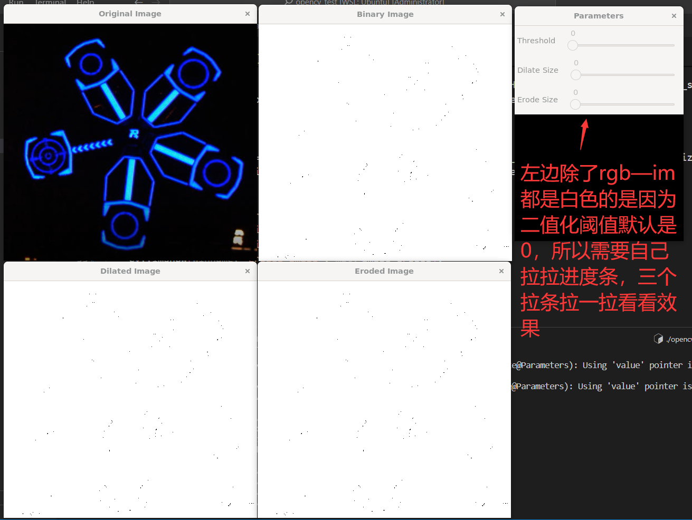

# 环境
mini-opencv project 

# 基础操作     
学习这个之前要把`Cpp`和`STL`有个大概的了解以及简单的使用.可以看我之前推荐的`黑马程序员`的教程。  

[Opencv速成教程推荐-Clik Here](https://www.bilibili.com/video/BV11A411T7rL/?spm_id_from=333.788&vd_source=4b919749e4033c3016c6c9503d7f3d52)  
只需要看完`Chapter1-Chanpter7`也就两个小时差不多，但是不能光看，还需要边看边写    
[配套课程资源下载处](https://www.computervision.zone/courses/opencv-cv/)，进这个国外网站可能需要点魔法，需要注册一个`Google`账号，所以需要设置一下科学上网。  
如果你不会弄的话，我已经下载好了，就在`3-opencv-cpp/docs/Resources.zip`目录下，请自行使用。    

# 装甲板识别  
套路略,这里给出一张图片可以尝试通过四周的亮灯条来识别出装甲板正中心在图像中的目标,基本流程就是以下步骤.  
- 二值化  
- 寻找亮斑轮廓  
- 通过灯条轮廓面积大小、宽高比等条件筛选灯条  
- 左右灯条匹配出一个装甲板  
- 对匹配出的装甲板截取之间的图像做数字识别以确保不受干扰        


# 大符识别  
## 读取原始RGB图片  
以下`code`的基础是在`2-linux环境配置`环境验证基础上的.    
code:  
```cpp
#include <opencv2/opencv.hpp>
int main() {
    // 读取图像文件
    cv::Mat image_rgb = cv::imread("../imgs/buff_ideal.png", cv::IMREAD_COLOR);
    // 检查图像是否成功加载
    if (image_rgb.empty()) {
        std::cout << "无法读取图像文件" << std::endl;
        return -1;
    }
    // 创建一个窗口并显示图像
    cv::namedWindow("Image", cv::WINDOW_AUTOSIZE);
    cv::imshow("Image", image_rgb);
    // 等待按键事件
    cv::waitKey(0);
    return 0;
}
```
result: 同上环境配置部分  
## 灰度图像、膨胀图像和腐蚀图像  
code:   
```cpp
#include <opencv2/opencv.hpp>

int main() {
    // 读取图像文件
    cv::Mat image_rgb = cv::imread("../imgs/buff_ideal.png", cv::IMREAD_COLOR);

    // 检查图像是否成功加载
    if (image_rgb.empty()) {
        std::cout << "无法读取图像文件" << std::endl;
        return -1;
    }

    // 转换为灰度图
    cv::Mat image_gray;
    cv::cvtColor(image_rgb, image_gray, cv::COLOR_BGR2GRAY);

    // 二值化
    cv::Mat image_binary;
    cv::threshold(image_gray, image_binary, 30, 255, cv::THRESH_BINARY);

    // 膨胀图像
    cv::Mat image_dilated;
    cv::Mat dilate_element = cv::getStructuringElement(cv::MORPH_RECT, cv::Size(10, 10));
    cv::dilate(image_binary, image_dilated, dilate_element);

    // 腐蚀图像
    cv::Mat image_eroded;
    cv::Mat erode_element = cv::getStructuringElement(cv::MORPH_RECT, cv::Size(3, 3));
    cv::erode(image_dilated, image_eroded, erode_element);

    // 显示图像
    cv::imshow("Original Image", image_rgb);
    cv::imshow("Binary Image", image_binary);
    cv::imshow("Dilated Image", image_dilated);
    cv::imshow("Eroded Image", image_eroded);

    cv::waitKey(0);

    return 0;
}
```
result:  

    

## 增加滑杆动态调节参数(非回调函数版本)  
code:  
```cpp
#include <opencv2/opencv.hpp>

int main() {

    // 创建窗口
    cv::namedWindow("Parameters");

    // 定义变量  
    int threshold_value = 30;
    int dilate_size = 1;
    int erode_size = 1;

    // 创建滑动条
    cv::createTrackbar("Threshold", "Parameters", &threshold_value, 255);
    cv::createTrackbar("Dilate Size", "Parameters", &dilate_size, 10);
    cv::createTrackbar("Erode Size", "Parameters", &erode_size, 10);

    // 读取图像文件
    cv::Mat image_rgb = cv::imread("../imgs/buff_ideal.png", cv::IMREAD_COLOR);

    // 转换为灰度图
    cv::Mat image_gray;
    cv::cvtColor(image_rgb, image_gray, cv::COLOR_BGR2GRAY);

    while(true){
        // 二值化
        cv::Mat image_binary;
        cv::threshold(image_gray, image_binary, threshold_value, 255, cv::THRESH_BINARY);

        // 膨胀图像
        cv::Mat image_dilated;
        cv::Mat dilate_element = cv::getStructuringElement(cv::MORPH_RECT, cv::Size(dilate_size*2+1, dilate_size*2+1), cv::Point(dilate_size, dilate_size));
        cv::dilate(image_binary, image_dilated, dilate_element);

        // 腐蚀图像
        cv::Mat image_eroded;
        cv::Mat erode_element = cv::getStructuringElement(cv::MORPH_RECT, cv::Size(erode_size*2+1, erode_size*2+1), cv::Point(erode_size, erode_size));
        cv::erode(image_dilated, image_eroded, erode_element);

        // 显示图像
        cv::imshow("Original Image", image_rgb);
        cv::imshow("Binary Image", image_binary);
        cv::imshow("Dilated Image", image_dilated);
        cv::imshow("Eroded Image", image_eroded);
        cv::waitKey(1);
    }
    

    return 0;
}
```  

## 增加滑杆动态调节参数(回调函数版本)
code:
```cpp
#include <opencv2/opencv.hpp>
// 回调函数，用于调节参数
void onTrackbar(int, void*) {  
    int threshold_value = cv::getTrackbarPos("Threshold", "Parameters");
    int dilate_size = cv::getTrackbarPos("Dilate Size", "Parameters");
    int erode_size = cv::getTrackbarPos("Erode Size", "Parameters");

    // 读取图像文件
    cv::Mat image_rgb = cv::imread("../imgs/buff_ideal.png", cv::IMREAD_COLOR);

    // 转换为灰度图
    cv::Mat image_gray;
    cv::cvtColor(image_rgb, image_gray, cv::COLOR_BGR2GRAY);

    // 二值化
    cv::Mat image_binary;
    cv::threshold(image_gray, image_binary, threshold_value, 255, cv::THRESH_BINARY);

    // 膨胀图像
    cv::Mat image_dilated;
    cv::Mat dilate_element = cv::getStructuringElement(cv::MORPH_RECT, cv::Size(dilate_size*2+1, dilate_size*2+1), cv::Point(dilate_size, dilate_size));
    cv::dilate(image_binary, image_dilated, dilate_element);

    // 腐蚀图像
    cv::Mat image_eroded;
    cv::Mat erode_element = cv::getStructuringElement(cv::MORPH_RECT, cv::Size(erode_size*2+1, erode_size*2+1), cv::Point(erode_size, erode_size));
    cv::erode(image_dilated, image_eroded, erode_element);

    // 显示图像
    cv::imshow("Original Image", image_rgb);
    cv::imshow("Binary Image", image_binary);
    cv::imshow("Dilated Image", image_dilated);
    cv::imshow("Eroded Image", image_eroded);
}

int main() {

    // 创建窗口
    cv::namedWindow("Parameters");

    // 创建滑动条
    cv::createTrackbar("Threshold", "Parameters", nullptr, 255, onTrackbar);
    cv::createTrackbar("Dilate Size", "Parameters", nullptr, 10, onTrackbar);
    cv::createTrackbar("Erode Size", "Parameters", nullptr, 10, onTrackbar);

    // 初始化参数
    onTrackbar(0, nullptr);

    cv::waitKey(0);

    return 0;
}
```
result:  
   
 
## 寻找轮廓 + 轮廓面积 + 绘制轮廓 + 最小外接矩形 
code:  
```cpp
#include <opencv2/opencv.hpp>

// init params
int threshold_value = 30;
int dilate_size = 2;
int erode_size = 1;

// 回调函数，用于调节参数
void onTrackbar(int, void*) {  
    // 读取图像文件
    cv::Mat image_rgb = cv::imread("../imgs/buff_ideal.png", cv::IMREAD_COLOR);

    // 转换为灰度图
    cv::Mat image_gray;
    cv::cvtColor(image_rgb, image_gray, cv::COLOR_BGR2GRAY);

    // 二值化
    cv::Mat image_binary;
    cv::threshold(image_gray, image_binary, threshold_value, 255, cv::THRESH_BINARY);

    // 膨胀图像
    cv::Mat image_dilated;
    cv::Mat dilate_element = cv::getStructuringElement(cv::MORPH_RECT, cv::Size(dilate_size*2+1, dilate_size*2+1), cv::Point(dilate_size, dilate_size));
    cv::dilate(image_binary, image_dilated, dilate_element);

    // 腐蚀图像
    cv::Mat image_eroded;
    cv::Mat erode_element = cv::getStructuringElement(cv::MORPH_RECT, cv::Size(erode_size*2+1, erode_size*2+1), cv::Point(erode_size, erode_size));
    cv::erode(image_dilated, image_eroded, erode_element);

    // 查找轮廓
    std::vector<std::vector<cv::Point>> contours;
    std::vector<cv::Vec4i> hierarchy;
    cv::findContours(image_eroded, contours, hierarchy, cv::RETR_TREE, cv::CHAIN_APPROX_SIMPLE);

    // 计算轮廓面积并打印
    struct AreaAndIndex
    {
        double area;
        int index;
        AreaAndIndex(double area_in, int index_in):area(area_in),index(index_in){}
    };
    std::vector<AreaAndIndex> contours_areas;
    for (int i = 0; i < contours.size(); i++) {
        double area = cv::contourArea(contours[i]);
        AreaAndIndex temp(area,i);
        contours_areas.push_back(temp);
    }
    // 使用 lambda 表达式按照 AreaAndIndex 结构体中的面积大小降序排序
    std::sort(contours_areas.begin(), contours_areas.end(), [](const AreaAndIndex& a, const AreaAndIndex& b) {
        return a.area > b.area; // 降序排序
    });
    //打印面积
    std::cout << "contours's area:" << std::endl;
    for(auto contour : contours_areas){
        std::cout << contour.area << " ";
    }
    std::cout << std::endl;
    

    // 绘制轮廓
    cv::Mat image_draw = image_rgb.clone();
    for (size_t i = 0; i < contours.size(); ++i) {
        if (hierarchy[i][3] == -1) {  // 外轮廓
            cv::drawContours(image_draw, contours, i, cv::Scalar(0, 0, 255), 2);
            // 计算最小外接矩形
            cv::RotatedRect minRect = cv::minAreaRect(contours[i]);
            cv::Point2f rect_points[4];
            minRect.points(rect_points);

            // 绘制最小外接矩形
            for (int j = 0; j < 4; j++) {
                cv::line(image_draw, rect_points[j], rect_points[(j + 1) % 4], cv::Scalar(255, 0, 0), 2);
            }
        } else {  // 内轮廓
            cv::drawContours(image_draw, contours, i, cv::Scalar(0, 255, 0), 2);
        }
    }
    
    

    // 显示图像
    cv::imshow("Original Image", image_rgb);
    cv::imshow("Binary Image", image_binary);
    cv::imshow("Dilated Image", image_dilated);
    cv::imshow("Eroded Image", image_eroded);
    cv::imshow("Contours Image", image_draw);
}

int main() {

    // 创建窗口
    cv::namedWindow("Parameters");

    // 创建滑动条
    cv::createTrackbar("Threshold", "Parameters", &threshold_value, 255, onTrackbar);
    cv::createTrackbar("Dilate Size", "Parameters", &dilate_size, 10, onTrackbar);
    cv::createTrackbar("Erode Size", "Parameters", &erode_size, 10, onTrackbar);

    // 初始化参数
    onTrackbar(0, nullptr);

    cv::waitKey(0);

    return 0;
}
```   
result:    
- 外轮廓用红色画出
- 内轮廓用绿色画出
- 外轮廓的最小外接矩形用蓝色画出    

效果如下:


上面代码涉及到几个要点需要自己学习一下。这里只是指出，需要大家锻炼自学搜资料和理解能力了.但其实主要还是应用，始终记住`Opencv`只是个工具，能实现就行，所以核心是要知道有这个东西，而不是反复多次重复来让自己背住再往下走，人往往一次是记不住太多东西的，遇见的多了自然就记住了。具体的实现可以让`chatgpt`实现。  
- `findContours`和`hierarchy`
  - `contours`: 数据类型`std::vector<std::vector<cv::Point>> contours;`相当于二维数组,`contours`是一个轮廓集合(简单说就是轮廓数组)，它的每个元素是一个点集`std::vector<cv::Point>`用来存储轮廓线(线是无数个点构成的)  
  - mode : `cv::RETR_TREE`这里选择了这种模式来寻找轮廓，此外还有另外两个`mode`，可以自己搜搜博客看看异同，主要影响的是`hierarchy`
  - `hierarchy`:一张图像中的轮廓是分层的，这个`hierarchy`是一个`std::vector<cv::Vec4i> hierarchy;`四维向量,存储轮廓们之间的层次关系的`[上一个轮廓，下一个轮廓，父轮廓，子轮廓]`
    - 父子关系 : 其中轮廓A被轮廓B完全包裹中的话，那么轮廓B就是轮廓A的父轮廓。其中A就是内轮廓，B就是外轮廓了。
    - 兄弟关系 : 非包裹关系
- `std::sort`
  - code
  ```cpp
    // 使用 lambda 表达式按照 AreaAndIndex 结构体中的面积大小降序排序
    std::sort(contours_areas.begin(), contours_areas.end(), [](const AreaAndIndex& a, const AreaAndIndex& b) {
        return a.area > b.area; // 降序排序
    });
  ```
  - lambda函数，匿名函数，同样是会用就行，实在不懂就提需求让`chatgpt`写
  - `std::sort`就是stl的内容，其中第三个参数就是自定义排序方式，所以需要传入一个操作也就是函数，这里为了方便就用了`lambda`函数，代码就会非常简洁
- `cv::minAreaRect`  
  - 这里涉及到opencv的一个`旋转矩形`的概念，因为二维平面嘛，矩形除了有四个点来构成矩形还需要知道矩形在二维平面所处的一个姿态，其实就是一个相对于垂直平面的轴的一个旋转角。  

## others
大家自己探索，识别出待击打(**有靶子**)和已击打的目标(**有环数**)。    
