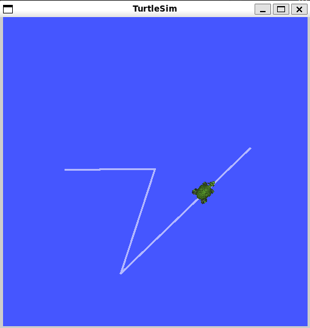

# **`ROS2-humble-LTS`安装**  
## `ROS2`安装  
- `Ubuntu22.04`
- `ROS2-humble`  

[EN-官网文档安装教程](https://docs.ros.org/en/humble/Installation/Ubuntu-Install-Debians.html)  
[CN-官方文档安装教程-翻译版本](https://getiot.tech/zh/ros2/ros2-installation-on-ubuntu/#:~:text=Ubuntu%2022.04%20%E5%AE%89%E8%A3%85%20ROS2%20Humble%201%20%E5%87%86%E5%A4%87%E5%B7%A5%E4%BD%9C%20%E8%AE%BE%E7%BD%AE%E8%AF%AD%E8%A8%80%E7%8E%AF%E5%A2%83,~nros-humble-%2A%20%20%26%26%20sudo%20apt%20%20autoremove%20)  
[CN-博客版本,但不用换清华源了](https://blog.csdn.net/qq_42151711/article/details/125675298)  

一般来说按照之前换了**中科大镜像源**之后，直接执行下面的命令即可,耐心等待，有问题的话就搜索一下解决方案.  
(copy from [CN-博客版本,但不用换清华源了](https://blog.csdn.net/qq_42151711/article/details/125675298) )
```bash
sudo apt update && sudo apt install locales
sudo locale-gen en_US en_US.UTF-8
sudo update-locale LC_ALL=en_US.UTF-8 LANG=en_US.UTF-8
export LANG=en_US.UTF-8
sudo apt install curl gnupg lsb-release
sudo curl -sSL https://raw.githubusercontent.com/ros/rosdistro/master/ros.key -o /usr/share/keyrings/ros-archive-keyring.gpg
echo "deb [arch=$(dpkg --print-architecture) signed-by=/usr/share/keyrings/ros-archive-keyring.gpg] http://packages.ros.org/ros2/ubuntu $(source /etc/os-release && echo $UBUNTU_CODENAME) main" | sudo tee /etc/apt/sources.list.d/ros2.list > /dev/null
sudo apt update && sudo apt upgrade
sudo apt install ros-humble-desktop
echo "source /opt/ros/humble/setup.bash" >> ~/.bashrc
```  
安装好之后重开终端运行以下命令 
```
ros2 run turtlesim turtlesim_node
```  
再重新开一个运行以下命令,然后在此终端下前后左右即可控制小乌龟运行    
```
ros2 run turtlesim turtle_teleop_key
```    


## **`rosdep`安装**  
这个最好在自己魔法上网的情况下安装，如果不会魔法上网的话就算了  
```bash
sudo apt update
sudo apt install python3-rosdep
```
```bash
sudo rosdep init # 没魔法的话,这一步大概率会失败  
rosdep update
```  
`rosdep `使用命令
```
rosdep install --from-paths /path/to/your/package --ignore-src --rosdistro <ros-distro>
```  
such as 
```bash  
rosdep install --from-paths src --ignore-src --rosdistro humble
```

# `Tutorials`    
