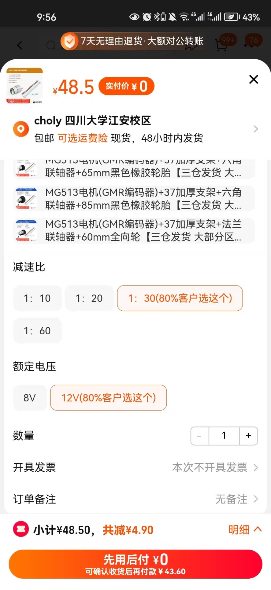
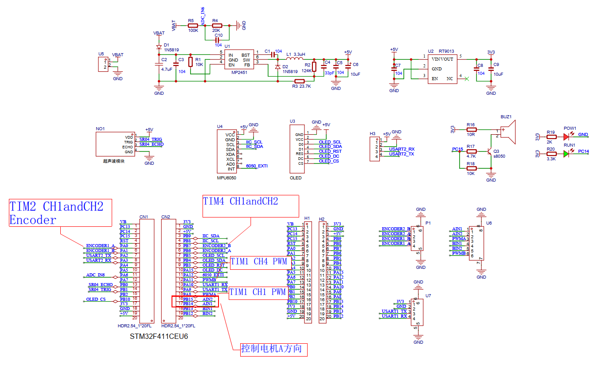
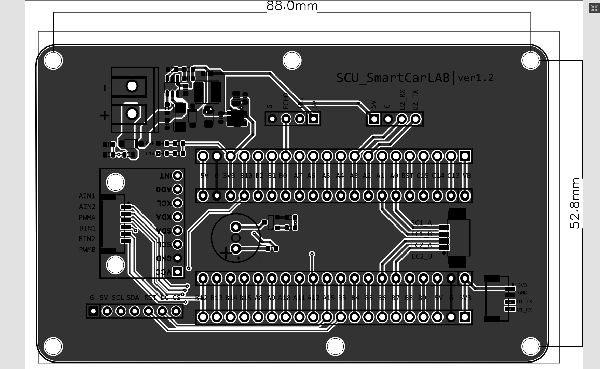
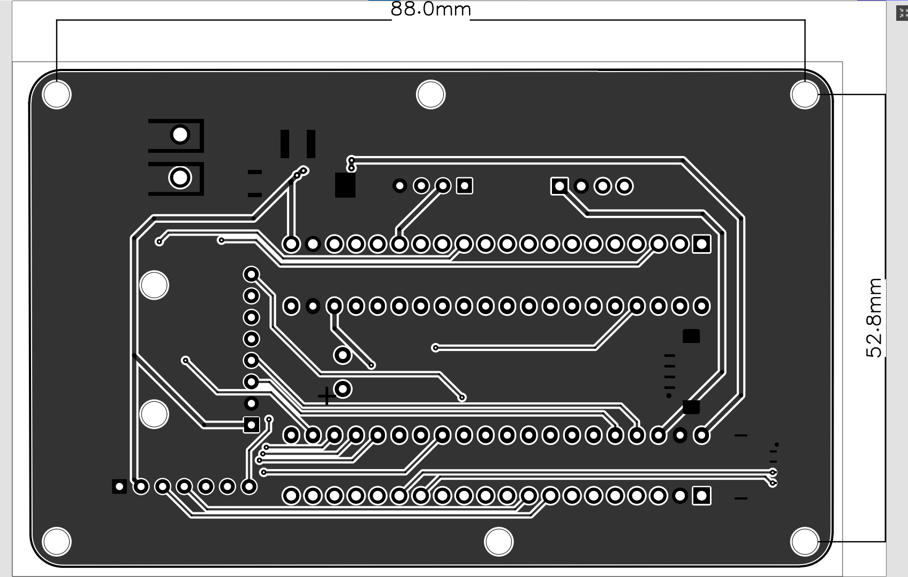

# 1. Author
**SCURM火锅战队** & **SCU-robomaster机器人协会** & **SCU-智能车协会**联手出品。  
# 2. 电子器件购买(点击下面的蓝色字体会跳转链接)
## 2.1. **核心板MCU**
主控处理器，核心处理单元，可以类比成电脑的CPU，这个很便宜并且够用      
[STM32F411CEU6推荐链接](https://m.tb.cn/h.5sJLxsJ?tk=K1LmWjCrQUF)  
## 2.2. **PWLink2下载器**
控制自动小车的代码在自己电脑上写，写完之后编译，编译结束后需要通过下载器下载到`MCU`也就是上面买的`STM32F411CEU6`    
[PWLink2推荐链接](https://m.tb.cn/h.5ILNPTD?tk=2mQhWjCIwoO)  

## 2.3. **电机Motor**
作用就不多说了，这边这种电机虽然比较贵但是性能不错，性价比比较高，可以学到很多东西，如果钱不够多的话可以做个三轮车，**两个直流电机轮** + **万向轮**  
[直流减速电机推荐链接](https://m.tb.cn/h.5ILnH6H?tk=tt3cWjCH3at)  
购买型号推荐如下所示:    
可以选择购买
- 12V-MG513电机(霍尔编码器)
  - 便宜编码器精度较低但完全够用(买这个就够了一般来说)
- 12V-MG513电机(GMR编码器) 
  - 贵但编码器精度较高
- 37加厚支架+法兰联轴器(直接买了配套的得了，省劲)
- 65mm黑色橡胶轮胎(看机械设计准备用什么轮子了，一般寻迹小车两轮差速橡胶轮胎就够用了)

## 2.4. **驱动板**
取决于买的什么电机和小车用几个电机，如果买的是我上面推荐的**直流电机**,就买同店铺中的`TB6612`驱动板。  
- 两个轮子就买`双驱TB6612`驱动板[链接](https://item.taobao.com/item.htm?id=43963555491&skuId=5003252502156&spm=a1z10.3-c-s.w4002-15726392041.11.aac3143e8ldYxJ)  
- 四个轮子就买`四驱TB6612`驱动板[链接ClickHere](https://m.tb.cn/h.5sJKUxj?tk=qM7aWjCHOAf)
- 四驱还可选`BTN7971`驱动板[链接ClickHere](https://m.tb.cn/h.5sJKUxj?tk=qM7aWjCHOAf )
  - 贵
  - 性能比`四驱TB6612`好且电路不容易坏

## 2.5. **12V电池和充电器**
这个不好推荐，大家可以自己找找，价钱差异很大，但是一定要买**12V**也称为**3S-11.1V电池**电池，电池容量可以买个稍低点容量的，这样价钱便宜点，电池和充电器要匹配对应上，一般卖电池的店里应该也会卖充电器.  
- [便宜电池链接](https://item.taobao.com/item.htm?ali_refid=a3_430673_1006:1108385165:N:zdthqbbRqXPYWHo4wgON4w==:c155a9763c61bd2e42ad048a5f1756b5&ali_trackid=162_c155a9763c61bd2e42ad048a5f1756b5&id=562015429673&skuId=3839888455378&spm=a2e0b.20350158.31919782.20)  这个不一定要在这个店里卖，只是给大家一个便宜电池长什么样子的一个参考。这种电池组的一般比较便宜，并且可充电，也基本够用了。但是注意不要过放，也就是把电完全用完才充电就不好，时间长了会损坏电池。  

- [航模电池(略贵)+平衡充](https://item.taobao.com/item.htm?ali_refid=a3_430673_1006:1109761773:N:krY09nCxpyMGkSHaOH371jSAbFWZ7EQR:765e1d9345b6e35415b1b12d3fde5ee9&ali_trackid=1_765e1d9345b6e35415b1b12d3fde5ee9&id=557703468898&spm=a2e0b.20350158.31919782.10&skuId=3640598683652) 这个同理，比较贵可能，充电器就在这个店里找找可以。这种航模电池一般分为一下几种接口，有公母头使用时可以注意下，一般采用`XT60`连接比较牢靠    
  - XT60
  - XT30
  - T接头

## 2.6. **母板和开发板**
因为核心板是统一的，要么用杜邦线连接，要么用`LCEDA`画一个`PCB`来连接`MCU`核心板和其他板子与线，但这个就需要一个人学习一下`LCEDA`如何绘制PCB，我的教程里的母板就是另外一个人做的，原理图和PCB布局图就放在下面了。没有这个板子的话也无所谓，用杜邦线直接把核心板和驱动板以及下载器等其他元器件引脚连接上即可，**做比赛的话需要根据自己的需求自行设计PCB电路和布局**。  

原理图:  
  

PCB布局:
  

## 2.7. **红外循迹模块**
感知车身是否跟在线中央  
[推荐链接](https://m.tb.cn/h.5sJJJqm?tk=aGCoWjCGCQf)

## 2.8. **杜邦线和接头**
就随便找了，那个便宜买哪个了

# 3. [教程链接](https://space.bilibili.com/479113889)
**[自动循迹小车讲解]**     
建议从头开始从前往后看不要跳，每一个视频都是有前后衔接关系的  
目前还缺一个环境配置。需要安装以下几个软件。  可以跟着这个视频来安装和获取安装包(如果不会从官网下载的话)[环境搭建-keil5+cubemx安装视频_哔哩哔哩_bilibili](https://www.bilibili.com/video/BV1wG411i7ms/?spm_id_from=333.337.search-card.all.click&vd_source=4b919749e4033c3016c6c9503d7f3d52)
以上视频版本在`2024/2/20`是最新的，后面几年更新新版本的话可以在B站上搜索其他教程安装，但这个应该也够用很多年了。  
1. keil: `MDK538a version`
2. stm32cubemx:`6.2.1 version` 
3. 软件包:`Keil.STM32F4xx_DFP.2.17.1.pack` 

最后， 希望大家都能学习到自己想要实现的东西。也欢迎大家多关注一些工科竞赛，提升一下四川大学在西南地区的工科竞赛竞技实力，最后也欢迎大家多了解**SCURM火锅战队**，来成为正式队员一起与其他院校同台竞技比赛，感受技术魅力。  